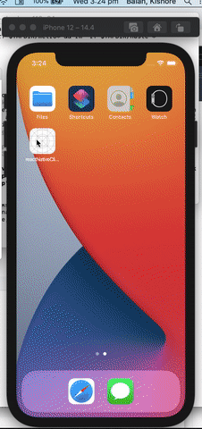
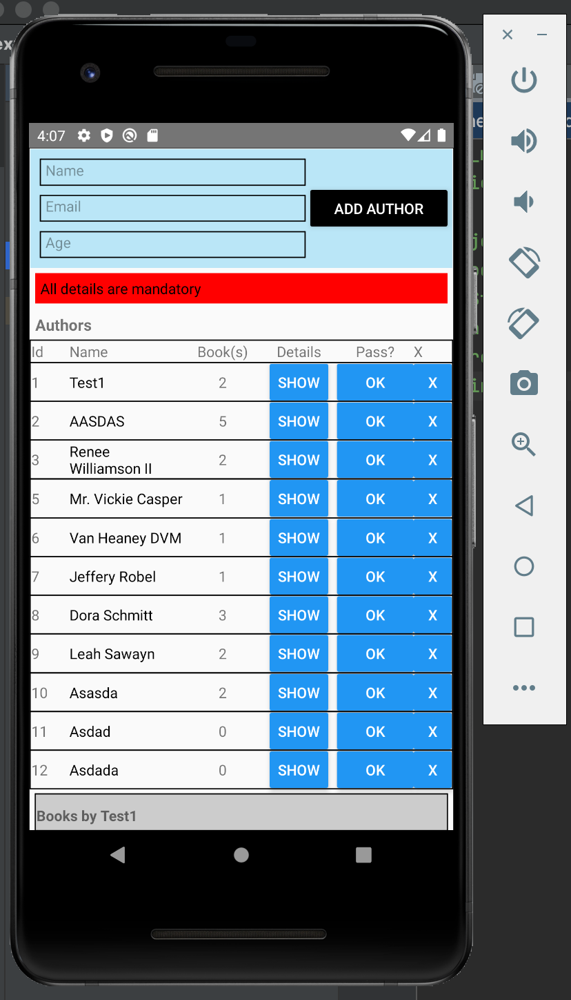

# reactNativeCliApp

## Works on IOS, Android and Browser.

### Sample application which calls an Express.js application (using TS and Mikrorm)

- Can add, update and list Authors
- Clicking on an author from the list, will populate author's books and its details
- Can add/remove book(s) by an Author

### TODO:
- Edit, Delete Author
- Edit, Delete Books
- Add tags, price
- Fix issues in Web, react-native-web

### Installation:

- Download repo
- npm install 
- `npm link` (for react-native-config) to work
- `npm run ios` (For running in Ios Simulator)
- `npm run android` (For running in Android Simulator)
- `npm run web` (for running in web, uses webpack to build)

- 

